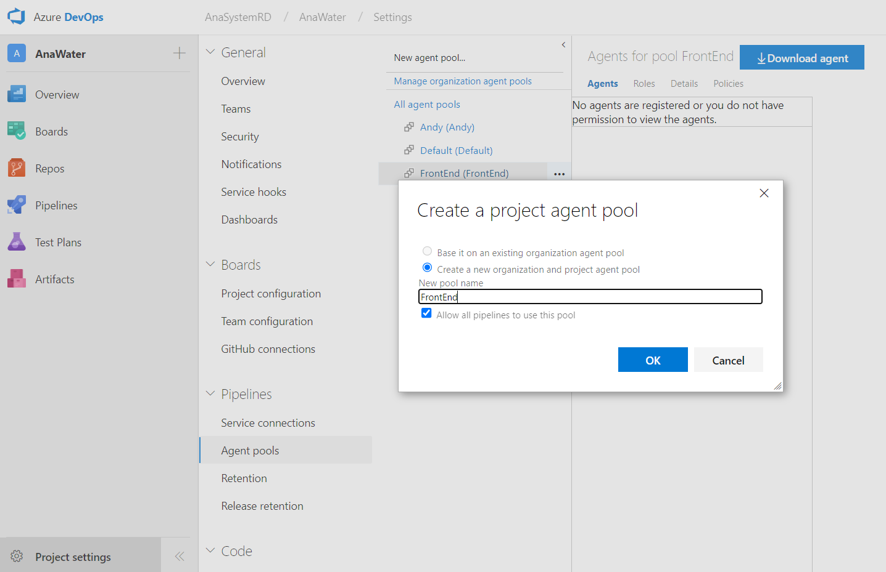
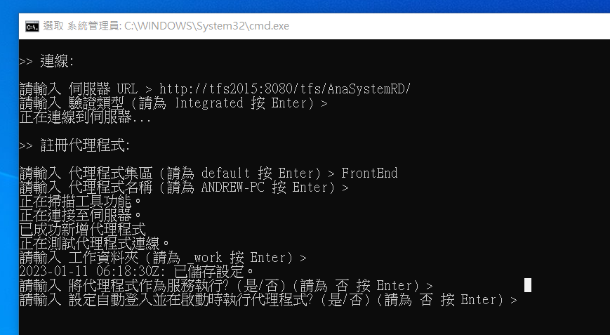

# Azure 代理程式集區

創建代理程式集區來使其幫我們完成建構的動作

&emsp;

# Windows
Project settings >Pipelines > Agent pools > New agent pool

建立代理程式集區後，選定建立的集區，按下右上方的 Download agent 按鈕，下載該代理。



&emsp;

將下載的代理檔案解壓縮，使用系統管理員運行 config.cmd，並依據引導輸入：

- 伺服器 URL：http://tfs2015:8080/tfs/${CollectionName}/
- 驗證類型：Integrated / Enter
- 註冊代理程式：${AgentPoolName}
- 代理程式名稱：可自行命名
- 工作資料夾：_work / Enter
- 將代理程式作為服務執行：是 / 否
- 設定自動登入並在啟動時執行代理程式：是 / 否



&emsp;

設定後，將整個資料夾搬移至 C:/，執行資料夾內的 run.cmd 來啟動該 agent。

> 💡 Windows 上目前使用 integrated 驗證，需要 VisualStudio 與 TFS server 有成功連線紀錄才可以驗證成功。

&emsp;

# Linux（CentOS 7）
```bash
# Download azure agent
mkdir ~/agent
cd ~/agent
curl https://vstsagentpackage.azureedge.net/agent/2.214.1/vsts-agent-linux-x64-2.214.1.tar.gz -O
tar zxvf vsts-agent-linux-x64-2.214.1.tar.gz

# Install agent dependencies
bash ./bin/installdependencies.sh

# Required for gssntlmssp
yum install -y epel-release

# Update now that we have epel-release
yum update -y

# Install libraries for NTLM support
yum install -y gssntlmssp

# Install Git
yum install -y https://packages.endpointdev.com/rhel/7/os/x86_64/endpoint-repo.x86_64.rpm
yum install -y git

# Set docker group
sudo usermod -aG docker $USER
newgrp docker

# Config agent
# ~/agent/config.sh

# Run agent
# nohup bash ~/agent/run.sh &> agent_run.log &
```

> 💡 Linux 上目前使用 negotiate 驗證，需要額外的 gssntlmssp 插件。

> 💡 CentOS 7 官方套件 git 最高版本為 1.8.3，而 docker 要求需要 git 高於版本 2 ，因此需使用額外套件庫升級 git 版本。

> 💡 Linux 上使用 Docker 需要權限，因此需要額外設定 User 至 Docker group 內。

> 💡 執行 config.sh 時，需要確認該機器能否連接到目標 URL，可能會因為 DNS 設定導致需要使用 IP 連接，現行需使用 192.168.10.241:8080 來連接公司內部的 TFS server。