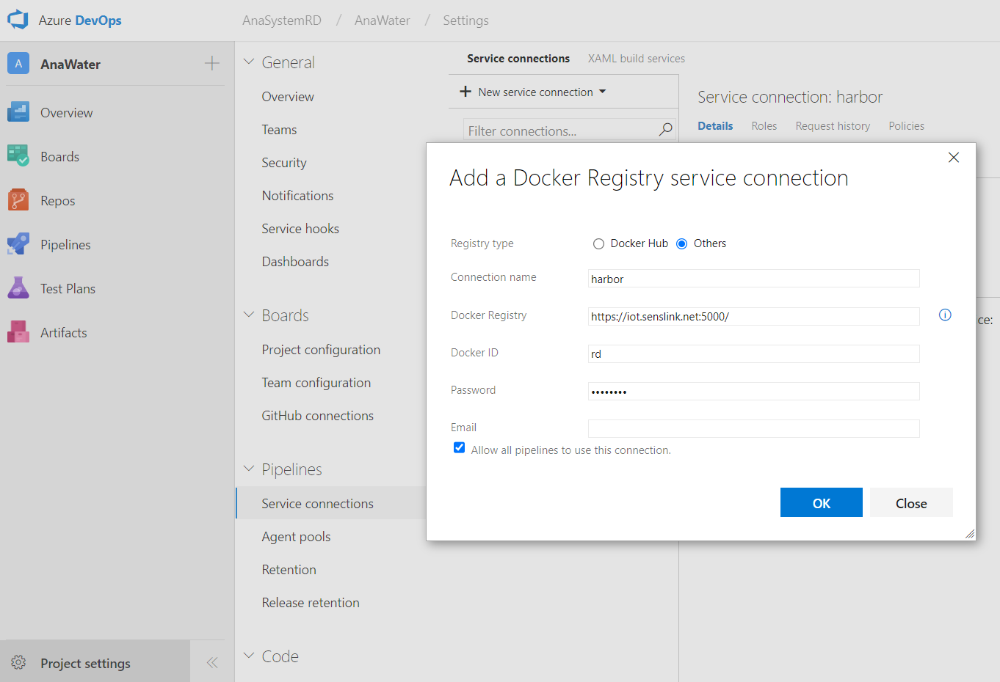
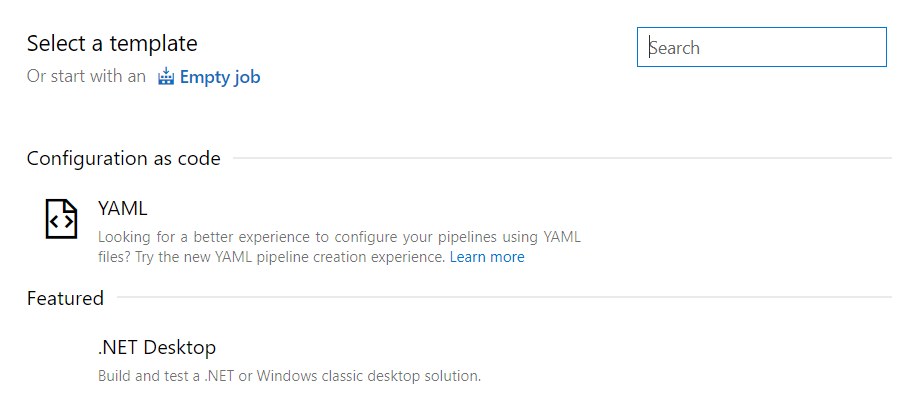

# Dockerlize & Azure CI

將專案改為使用 Azure 代理程式集區 build Docker image

&emsp;

# Azure DevOps 設定

要使用 Azure Pipeline，須先行設定以下事項：

Project settings

- 建立 代理程式集區 Agent pool （by Whole TFS）
- 建立 連線服務 Service connections （by Project）

Pipelines

- 建立 建構管線 Build pipeline （by Project）

&emsp;

# 代理程式集區 Agent pool

要使用代理程式運行 build 程序，需要建立 / 選定一個代理程式集區。

Windows 與 Linux 使用代理程式集區的設定不同，詳細請參考此頁面：

[建立一個新的 Agent pool](https://github.com/azusa5526/Notes/blob/master/azure-agent-pool/index.md)

&emsp;

# 連線服務 Service connections

要將建構好的 Image 傳至 Harbor，需要針對專案建立連線服務。

Project settings >Pipelines > Service connections > New service connection > Docker Registry

填入 Harbor 所在的位置、登入的名稱與密碼並建立。



&emsp;

# 建構管線 Build pipeline

要讓 CI 運行，必須設定 build 專案的 pipeline。

in a project > Pipelines > Builds > New > New build pipeline

選擇 Project、Repository、以及觸發 Build 的 Branch。


選擇 YAML



命名 CI 名稱，並指定要使用的 Agent pool、YAML file 的路徑，最後按下儲存。


&emsp;

# 新增 Dockerfile

專案根目錄新增 Dockerfile。

```docker
FROM node:14.17.0 AS builder
WORKDIR /app
COPY . .
RUN npm install && npm install -g @vue/cli && npm run build:stage

FROM nginx
ENV TZ=Asia/Taipei
RUN ln -snf /usr/share/zoneinfo/$TZ /etc/localtime && echo $TZ > /etc/timezon
COPY nginx/default.conf /etc/nginx/conf.d/default.conf
COPY --from=builder /app/dist/ /usr/share/nginx/html/timelapse
```

COPY 專案目錄下所有內容至 docker 目錄底下

RUN npm install, npm install -g @vue/cli 安裝開發環境到 docker 環境

RUN build/build:stage 產生 dist 目錄與 production code

COPY 專案目錄下 nginx/default.config 至 docker /etc/nginx/conf.d/default.conf 

COPY builder 階段生產出來的 dist 目錄底下所有檔案至 /usr/share/nginx/html/${publicPath}
   
> 💡 Dockerfile 描述為 from / to 描述，例如最後一行的命令為，拷貝 /app/dist/ 資料夾底下內容，至 /usr/share/nginx/html/timelapse 底下。

&emsp;

# 新增 azure-pipelines.yml

專案根目錄新增 azure-pipelines.yml

```yaml
variables:
  IMAGENAME: 'iot.senslink.net:5000/web_timelapse/repo'
  VERSION: '!undefined'

pool:
  name: Owen

resources:
  - repo: self
    fetchDepth: 1

trigger:
  - release-stage

steps:
  - bash: |
      VERSION=$(cat package.json | grep version | head -1 | awk -F: '{ print $2 }' | sed 's/[",]//g' | sed 's/^[ \t]*//g')
      echo $VERSION
      echo "##vso[task.setvariable variable=VERSION]$VERSION"
    displayName: 'Prepare variable'

  - task: Docker@1
    displayName: 'Build an image'
    inputs:
      containerregistrytype: 'Container Registry'
      dockerRegistryEndpoint: harbor
      command: Build an image
      imageName: '$(IMAGENAME):$(VERSION)'
      arguments: '-t $(IMAGENAME):latest'

  - task: Docker@1
    displayName: 'Push an image'
    inputs:
      containerregistrytype: 'Container Registry'
      dockerRegistryEndpoint: harbor
      command: Push an image
      imageName: '$(IMAGENAME)'
      arguments: '--all-tags'
```

variables > IMAGENAME：harbor 項目名稱

pool > name：azure 代理程式集區名稱

trigger：觸發 CI 更新的 branch 名稱

&emsp;

# 新增 Nginx

專案根目錄新增 nginx 資料夾，內部新增 default.conf 檔案，基本上不需做修改。

```
server {
    listen       80;
    server_name  localhost;
    
    access_log  /var/log/nginx/host.access.log  main;
    error_log  /var/log/nginx/error.log  error;

    location / {
        root   /usr/share/nginx/html;
        index  index.html index.htm;
        try_files $uri $uri/ /index.html;
        add_header Cache-Control "public, max-age=63072000";
        add_header Vary Accept-Encoding;
        access_log off;
    }

    error_page   500 502 503 504  /50x.html;
    location = /50x.html {
        root   /usr/share/nginx/html;
    }
}
```

&emsp;

# 將 Harbor 上的 Image 手動佈署至測試環境


需修改佈署環境下的三個配置文件。

- docker-compose.yml
- nginx.conf
- restart.sh

下面寫上需要更改的配置。

&emsp;

# docker-compose.yml

```yaml
version: '2'

services:
    vue_timelapse:
        image: iot.senslink.net:5000/web_timelapse/repo
        restart: always

    api:
        image: iot.senslink.net:5000/api_anasystem_ota/repo:1.0.19
        restart: always
        environment:
            - ASPNETCORE_ENVIRONMENT=Production
            - ASPNETCORE_URLS=http://+:21021
            - TZ=Asia/Taipei
        #ports:
            # - 11111:21021
        logging:
            options:
                max-size: "10m"
                max-file: "1"
        volumes:
            - ./app/Host-Logs:/app/App_Data/Logs
            - ./app/wwwroot/images:/app/wwwroot/images
            - ./app/wwwroot/web:/app/wwwroot/web
            - ./app/wwwroot/admin:/app/wwwroot/admin
            - ./app/wwwroot/apps:/app/wwwroot/apps
            - ./app/Configs/appsettings.json:/app/appsettings.json
            - ./app/Configs/log4net.config:/app/log4net.Production.config
            - ./images:/app/images
        depends_on:
            - db

    migrator:
      image: mcr.microsoft.com/dotnet/aspnet:5.0
      volumes:
        - ./migrator:/app

    nginx:
      image: nginx:1.18
      restart: always
      environment:
        - NGINX_HOST=foobar.com
        - NGINX_PORT=80
      ports:
        # - 443:443
        - 12345:80
      volumes:
        - ./nginx/nginx.conf:/etc/nginx/nginx.conf:ro
        - ./nginx/proxy.conf:/etc/nginx/proxy.conf:ro
        - ./nginx/ssl/local.crt:/etc/ssl/certs/localhost.crt:ro
        - ./nginx/ssl/local.key:/etc/ssl/certs/localhost.key:ro
        - ./nginx/logs/:/var/log/nginx/
      depends_on:
        - api

    db:
      image: mysql/mysql-server:5.7
      restart: always
      environment:
        # MYSQL_DATABASE: AnaWater
        MYSQL_USER: root
        MYSQL_PASSWORD: p@ssw0rd
        MYSQL_ROOT_PASSWORD: p@ssw0rd
        MYSQL_ROOT_HOST: '%'
      ports:
        - 23306:3306
      volumes:
        - ./mysql/sqls:/docker-entrypoint-initdb.d
        - ./mysql/db:/var/lib/mysql
```

- services 區塊增加前端 App 的 Service name，並將 Image 指定為 Harbor image 的路徑。

&emsp;

# nginx.conf

```
user nginx;

worker_processes    auto;

events { worker_connections 1024; }

http {
    include             /etc/nginx/proxy.conf;
    include             /etc/nginx/mime.types;
    #limit_req_zone      $binary_remote_addr zone=one:10m rate=5r/s;
    server_tokens       off;
    sendfile            on;
    keepalive_timeout   29; # Adjust to the lowest possible value that makes sense for your use case.
    client_body_timeout 10; client_header_timeout 10; send_timeout 10;

    upstream webapi {
        server          api:21021;
        keepalive       100;
    }

    upstream web_timelapse {
        server          vue_timelapse:80;
        keepalive       100;
    }

    server {
        listen          80;
        server_name     $hostname;

        location / {
            proxy_pass  http://webapi;
            #limit_req   zone=one burst=10 nodelay;
        }

        location ^~ /timelapse/ {
            proxy_pass  http://web_timelapse/timelapse/;
        }
    }

    server {
        listen                      443 ssl;
        server_name                 open.iatyu.nat.gov.tw;
        ssl_certificate             /etc/ssl/certs/localhost.crt;
        ssl_certificate_key         /etc/ssl/certs/localhost.key;
        #ssl_certificate             /etc/ssl/certs/domain.crt;
        #ssl_certificate_key         /etc/ssl/certs/domain.rsa;
        ssl_protocols               TLSv1.1 TLSv1.2;
        ssl_prefer_server_ciphers   on;
        ssl_ciphers                 "EECDH+AESGCM:EDH+AESGCM:AES256+EECDH:AES256+EDH";
        ssl_ecdh_curve              secp384r1;
        ssl_session_cache           shared:SSL:10m;
        ssl_session_tickets         off;
        client_max_body_size        100M;

        add_header Strict-Transport-Security "max-age=63072000; includeSubdomains; preload" always;

        location / {
            proxy_pass http://webapi;
            #limit_req  zone=one burst=10 nodelay;
        }
    }
}
```

- http 區塊增加  upstream ${alias} 屬性，並設定其 server 屬性為 Services 區塊剛剛添加的名稱以及對應的 Port（這裡為 vue_timelapse:80）
- http 區塊的 server 屬性內增加 location 對應的路由，這裡 ^~ /timelapse/ 代表的是 timelapse 底下全部的路徑，都對應到指定的 proxy_pass。

&emsp;

# restart.sh

```bash
docker pull iot.senslink.net:5000/api_anasystem_ota/repo:1.0.19 &&
docker pull iot.senslink.net:5000/web_timelapse/repo &&
docker-compose down && docker-compose up -d
```

- 將所有需要的 image 列出並 pull 下來
- 停止 docker-compose，再啟動 docker-compose 並 -d 於背景運行

&emsp;